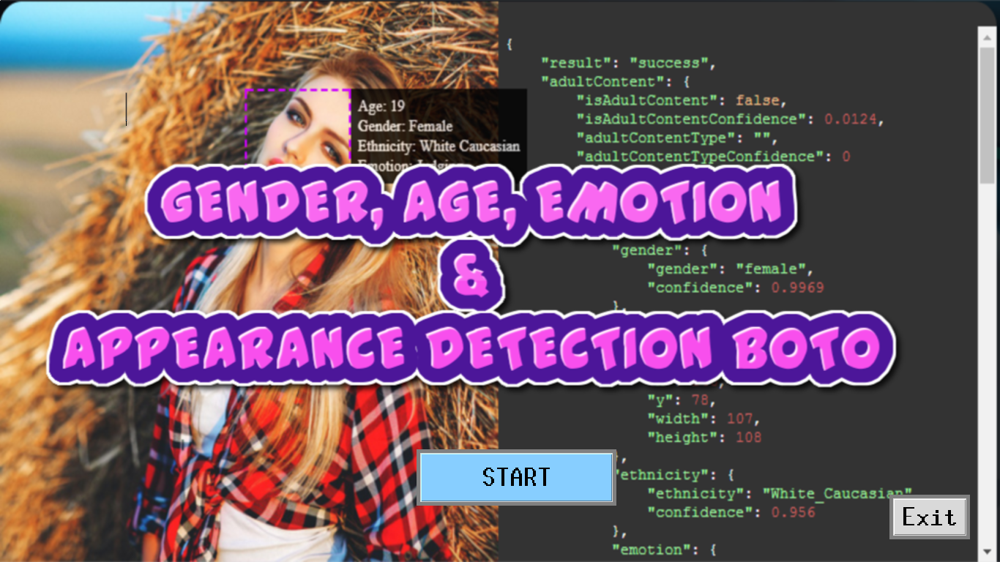

#WELCOME SCREEN

#OUTPUT SCREEN

#GENDER, AGE, EMOTIONS & APPEARANCE DETECTION USING BOTO3

In this project we have used BOTO3 (especially detect_faces()) to find gender, age, emotions and appearance from image. Under AWS Rekognition, there are various methods. Some of them are :

    can_paginate()
    compare_faces()
    create_collection()
    create_project()
    create_project_version()
    create_stream_processor()
    delete_collection() & so on....

Among them we are going to use detect_faces(). For each face detected, the operation returns face details. These details include a bounding box of the face, a confidence value (that the bounding box contains a face), and a fixed set of attributes such as facial landmarks (for example, coordinates of eye and mouth), presence of beard, sunglasses, and so on.

In this project we are going to use following features:

-**AgeRange**: It is used to predict the age range of the face of an image. Low represents the lowest estimated age and High represents the highest estimated age.
`str(x['AgeRange']['Low'])` `str(x['AgeRange']['High'])`

- **Smile**: It is used to find if the person in face is smiling or not. `str(x['Smile']['Value']`

- **Eyeglasses** : It is used to find whether face is wearing eye glasses or not.

& other features are described here :- [ link](https://boto3.amazonaws.com/v1/documentation/api/latest/reference/services/rekognition.html#Rekognition.Client.detect_faces)

#About Our UI

We have used Tkinter which is Python's de-facto standard GUI (Graphical User Interface) package. 

#INSTALLATION GUIDE
1. Download the Zip folder & Extract It
2. Goto folder & open it in terminal
3. Type `python proceed.py` on terminal & press enter
4. Click on Start as you have nothing to do with First Screen 
5. Select the Image & click on Predict button 
6. BOOM !! 

#Requisites
- Python 3
- Boto 3 `pip install boto3`
- Install Tkinter `pip install tk-tools`

Note: Don't forget to configure AWS before running the code.

Contact [link](https://aihubprojects.com) for details
